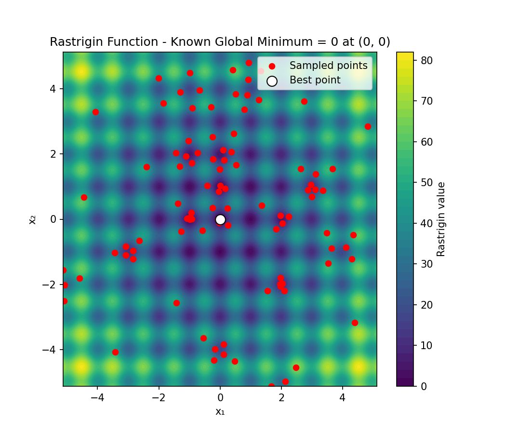
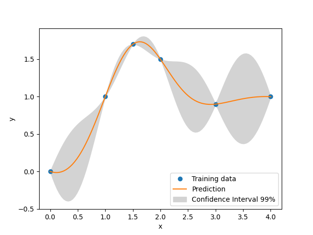

+++
title = "Examples"
weight = 20
+++

# Examples

The Python snippets below are included directly from source files under [`python/egobox/examples`](https://github.com/relf/EGObox/tree/master/python/egobox/examples/).
Here you can just copy-paste the code to run it locally, or click on the links to open the source files in a new tab.

## Optimization with _Egor_

### Unconstrained optimization: [Rastrigin](https://github.com/relf/EGObox/blob/master/python/egobox/examples/rastrigin.py)

{{ include_code(
    url="https://raw.githubusercontent.com/relf/EGObox/refs/heads/master/python/egobox/examples/rastrigin.py",
    lang="python") 
}}

```bash
Using infill strategy: InfillStrategy.LOG_EI

===== Optimization Result =====
Best value (y*): [0.00348963]
Best point (x*): [ 0.00415341 -0.00058284]
```



### Constrained optimization: [G24](https://github.com/relf/EGObox/blob/master/python/egobox/examples/g24.py)

{{ include_code(
    url="https://raw.githubusercontent.com/relf/EGObox/refs/heads/master/python/egobox/examples/g24.py",
    lang="python") 
}}

```bash
Optimization f=[-5.50853583e+00  8.65985077e-04  3.83913510e-04] at [2.32948272 3.17905311]
```

## Surrogate modeling with _Gpx_

### Simple surrogate model: [Kriging](https://github.com/relf/EGObox/blob/master/python/egobox/examples/kriging.py)

{{ include_code(
    url="https://raw.githubusercontent.com/relf/EGObox/refs/heads/master/python/egobox/examples/kriging.py",
    lang="python") 
}}

 